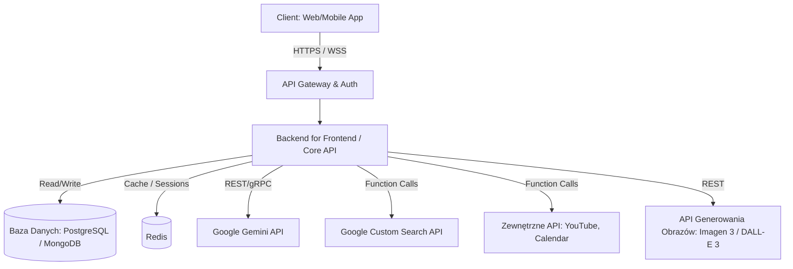

# Plan Aplikacji Czatowej: "SmartCompanion"

## 1. Wstęp i Cel Projektu
**SmartCompanion** to zaawansowana aplikacja czatowa, mająca na celu emulację interfejsu i bogatych możliwości znanych z Gemini Advanced. Aplikacja budowana jest od podstaw (w ramach projektu `gemini_ui`) jako spersonalizowany interfejs, w którym użytkownicy korzystają z własnych kluczy API Google Gemini. Umożliwia ona multimodalne interakcje, obsługę długiego kontekstu, użycie zewnętrznych narzędzi (Function Calling) oraz generowanie obrazów, przy czym wszystkie operacje i ustawienia są zarządzane centralnie na bezpiecznym serwerze.

---

## 2. Architektura Systemu

Proponowana architektura to klasyczny, nowoczesny podział na Frontend (Client), Backend (API Server / Gateway) oraz bazę danych, ułożone w architekturze mikroserwisowo-modularnej dla łatwiejszego skalowania.



### Warstwy:
1. **Frontend (UI)**: Odpowiada za wyświetlanie interfejsu, renderowanie Markdown/HTML, zarządzanie stanem lokalnym (np. wpisywanie tekstu, podgląd obrazów).
2. **Backend (API Server / Gateway)**: Główny silnik zarządzający logiką biznesową. Przechowuje sekrety, komunikuje się z LLM (Gemini API), zarządza tokenami, autoryzuje użytkowników i wykonuje Function Calling ze względów bezpieczeństwa.
3. **Baza Danych**: Trwałe przechowywanie użytkowników, sesji konwersacji (wątków) oraz logów wiadomości.
4. **Zewnętrzne Interfejsy (APIs)**: Gemini API jako rdzeń analityczny, usługi pomocnicze (Search, Image Gen).

---

## 3. Wybór Technologii

| Warstwa | Technologia / Narzędzie | Uzasadnienie |
| :--- | :--- | :--- |
| **Frontend** | React / Next.js (Web) lub React Native (Mobile) | Szybkie renderowanie dynamicznych zwrotów strumieniowych (Streaming), bogaty ekosystem komponentów UI (np. TailwindCSS, Radix UI). Next.js oferuje łatwe wdrożenie i SSR dla lepszego UX początkowego. |
| **Stylizacja** | TailwindCSS + Framer Motion | Tailwind dla szybkiego i spójnego stylowania adekwatnego do "premium" designu, Framer Motion do płynnych mikro-animacji. |
| **Backend** | Node.js (Express / NestJS) lub Python (FastAPI) | Node.js (szczególnie w obrębie Next.js API Routes / Server Actions) zapewnia łatwą synchronizację typów (TypeScript). Python (FastAPI) jest doskonały dla operacji na danych, integracji AI i asynchroniczności. |
| **Baza Danych** | PostgreSQL (Relacyjna) + pgvector | PostgreSQL to solidny standard branżowy do relacji Użytkownik <-> Sesja <-> Wiadomości. Rozszerzenie `pgvector` przygotowuje system na przyszłe wyszukiwanie semantyczne (RAG). |
| **Pamięć podręczna**| Redis | Do zarządzania szybkimi licznikami rate-limitingu, stanu połączeń WebSockets/SSE strumieniowania odpowiedzi oraz cachowania najczęstszych pytań. |
| **Modele AI** | `gemini-1.5-pro` (tekst, vision, function calling), `imagen-3` / `dall-e-3` (generowanie obrazów) | Najnowsze modele od Google do zarządzania pełnym kontekstem i logiką. |

---

## 4. Szczegółowy Opis Funkcjonalności

### 4.1 Podstawowy Interfejs Czatowy (UI/UX)
- **Design System**: Czysty interfejs z obsługą ciemnego motywu (Dark Mode) i efektami glassmorphism. Nowoczesna typografia (np. *Inter*).
- **Zarządzanie Sesjami**: Lewy panel boczny wyświetla historyczne wątki rozmów (sortowanie malejąco po dacie). Użytkownik może edytować tytuły lub je usuwać.
- **Renderowanie Treści**: Integracja parsera Markdown (np. `react-markdown`), by odpowiednio formatować kod (z kolorowaniem składni), tabele, listy i równania matematyczne (KaTeX).
- **Strumieniowanie**: Użycie Server-Sent Events (SSE) lub WebSocketów (np. Vercel AI SDK), aby odpowiedź LLM "pisała się" na ekranie w czasie rzeczywistym.

### 4.2 Zarządzanie Kontekstem Rozmowy i Tokenami
- **Przekazywanie wiadomości**: Każde zapytanie składa się w ustandaryzowaną tablicę obiektów.
  ```json
  [
    {"role": "user", "parts": [{"text": "Cześć!"}]},
    {"role": "model", "parts": [{"text": "Witaj! W czym mogę pomóc?"}]}
  ]
  ```
- **Zarządzanie Oknem Kontekstu (Token Limit Management)**:
  - Choć `gemini-1.5-pro` obsługuje do 1-2 mln tokenów, pełne okno generuje koszty ok. Jeśli limit lub budżet jest bliski przekroczenia:
  - **Mechanizm przesuwanego okna (Sliding Window)**: Starsze wiadomości są automatycznie pomijane przy wysyłaniu.
  - **Podsumowywanie w tle (Summarization)**: Backend używa tańszego modelu (np. `gemini-1.5-flash`), aby co `X` wiadomości wygenerować twarde streszczenie poprzedniej połowy rozmowy. Do API przesyłamy zaledwie [SYSTEM PROMPT + STRESZCZENIE + OSTATNIE N WIADOMOŚCI].

### 4.3 Multimodalność (Input Obrazu)
- **Komponent przesyłania**: Drag-and-drop w oknie czatu, umożliwiający upload plików graficznych (JPEG, PNG, WebP).
- **Procesowanie**: Plik jest wczytywany na frontendzie i skalowany (aby zmniejszyć wagę), a następnie zamieniany na ciąg znaków **Base64** lub wrzucany do Google Cloud Storage (`gs://...`). W przypadku przesyłu online polega to na przekazaniu:
  ```json
  "inlineData": {
    "mimeType": "image/jpeg",
    "data": "<BASE64_STRING>"
  }
  ```

### 4.4 Integracja z Narzędziami Zewnętrznymi (Function Calling)
- Model otrzymuje w parametrze `tools` definicje dostępnych funkcji. Jeśli model ich użyje, aplikacja backendowa dokonuje rzeczywistego wywołania, i zwraca wynik.
- **Wyszukiwanie (Google Search)**:
  - Funkcja: `search_internet(query: string)`
  - Backend nasłuchuje na polecenie, a jeśli nastąpi zgłasza `query` do *Google Custom Search JSON API* (lub silników typu Tavily/SerpApi) i zwraca podsumowanie 5 górnych wyników.
- **Integracja YouTube API**:
  - Funkcja: `search_youtube_video(topic: string)`
  - Wywołanie do YouTube Data API. Zwraca do modelu: `Tytuł, Autor, Link`. Model generuje grzeczną odpowiedź z dołączonymi linkami lub embedami iframe na frontendzie.

### 4.5 Generowanie Obrazów (Output)
- Model analizator (Gemini) podejmuje decyzję. Jeśli intencją użytkownika jest *stwórz/narysuj obraz*, wypuszcza wywołanie narzędzia: `generate_image(prompt: string)`.
- **Implementacja**: Backend przechwytuje Function Call `generate_image`, wykonuje zapytanie do API **Google Imagen 3** (przez Vertex AI) lub **OpenAI DALL-E 3**. Otrzymany URL obrazu lub ciąg Base64 zostaje wysłany do klienta (z rolą AI) i formatowany do estetycznego tagu ``.

### 4.6 Opcje Użytkownika i Parametry API (`gemini_ui`)
- Aplikacja `gemini_ui` służy jako dedykowany interfejs, w którym każdy użytkownik posiada własny profil.
- **Własne klucze API**: Użytkownik w panelu ustawień wprowadza własny klucz API Gemini. Kiedy klient wysyła zapytanie (np. wiadomość na czacie), backend identyfikuje użytkownika i wykorzystuje przypisany do niego klucz (z bazy danych) wykonując zapytanie do Google Gemini.
- **Konfiguracja na serwerze**: Ustawienia parametrów czatu dla danego użytkownika (m.in.: `temperature` dla poziomu kreatywności, `max_output_tokens` dla długości odpowiedzi, `top_p`, `top_k`) modyfikowane są wprawdzie z poziomu interfejsu przeglądarki, ale bezpiecznie zapisywane, utrzymywane i przetwarzane wyłącznie na serwerze (np. w PostgreSQL).
- **Zarządzanie Personą**: Możliwość ustawienia domyślnego promptu systemowego (System Instruction) dla poszczególnych "agentów" lub w globalnych ustawieniach konta.

---

## 5. Zarządzanie Kluczami i Bezpieczeństwo

- **Ochrona Kluczy Użytkowników**: Ponieważ użytkownicy uwierzytelniają się własnymi kluczami API, **NIGDY** nie są one przechowywane na stałe w pamięci przeglądarki (np. LocalStorage) w sposób jawny, ani nie wykonuje się na nich zapytań z frontendu bezpośrednio do Google. Klucze po wpisaniu przesyłane są bezpiecznym kanałem (HTTPS) do backendu, zapamiętywane w chronionej bazie danych (zaszyfrowane przy użyciu silnego algorytmu, np. AES-256) i wykorzystywane na serwerze podczas formułowania żądania.
- **Autoryzacja Użytkowników**: Przez integrację systemów (np. Auth0, Clerk, NextAuth) lub standardowe logowanie z użyciem JWT. Dostęp do własnego konta, historii czatów oraz zaszyfrowanych kluczy API jest rygorystycznie chroniony.
- **Ochrona przed wyciekami**: Wszelka komunikacja zewnętrzna, jak również korzystanie z innych modeli AI (jeśli będą integrowane) czy wyszukiwarek omija w pełni klienta - wszystko dzieje się pod kontrolą serwera (Backend for Frontend).

---

## 6. Skalowalność
1. **Bezanowa Architektura Pamięci Kontekstu**: Trzymanie sesji po stronie klienta i w szybkiej bazie NoSQL / Redis ogranicza zużycie pamięci maszkalnej na backendzie.
2. **Serverless / Konteneryzacja**: Użycie Docker + Kubernetes (GKE, EKS) na backend. Pozwala skalować usługę procesującą tylko wtedy, kiedy występuje gwałtowny skok ruchu. Frontend można hostować bezserwerowo na Vercel / Netlify w obrębie brzegowej sieci CDN.
3. **Kolejkowanie asynchroniczne**: Wykorzystanie Apache Kafka / RabbitMQ dla ciężkich operacji (jak równoległe tworzenie 4 obrazów i wyszukiwanie).

---

## 7. Model Dystrybucji i Utrzymania (Brak Monetyzacji)

- **Bring Your Own Key (BYOK)**: Ze względu na to, że aplikacja `gemini_ui` działa w modelu, gdzie każdy użytkownik zapewnia swój własny klucz API dostępowy do usług Google, system nie wdraża ani nie wymaga planów subskrypcyjnych, pay-per-use czy freemium nastawionych na generowanie bezpośredniego zysku za użytkowanie usług AI.
- **Koszty API**: Użytkownik bezpośrednio ponosi koszty wygenerowania tokenów (bądź korzysta z darmowego planu taryfowego "Free Tier") z poziomu własnego konta billingowego w Google AI Studio lub Google Cloud.
- **Utrzymanie Serwera**: Głównym celem projektowym jest stworzenie doskonałego interfejsu (Self-Hosted Model). Oznacza to, że użytkownik lub organizacja wdraża projekt na własnej infrastrukturze (np. przy użyciu w pełni przygotowanego kontenera Docker na domowym NAS czy VPS), gwarantując stuprocentową prywatność rozmów. Zatem wszystko przetwarza darmowy self-hosted backend.
